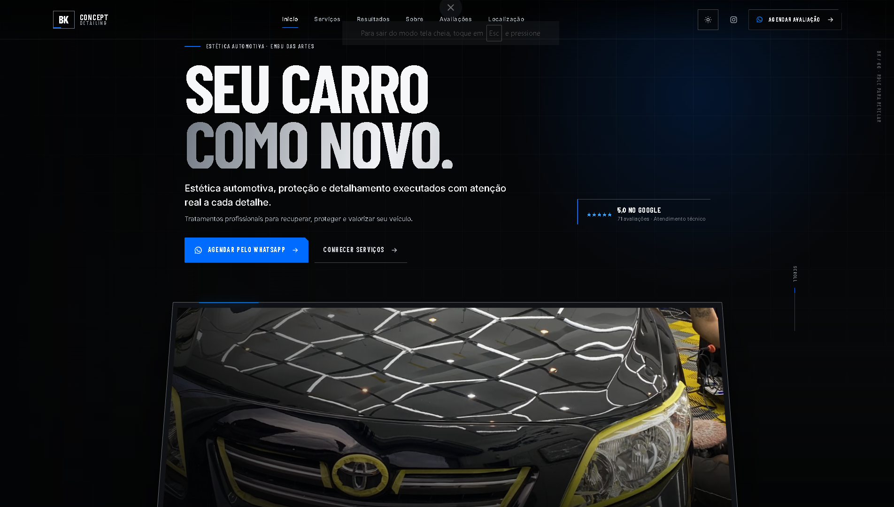

# BK Concept Detailing

Website institucional desenvolvido para a **BK Concept Detailing**, empresa de estética automotiva localizada em Embu das Artes, São Paulo.

O projeto foi criado com foco em apresentação dos serviços, valorização dos resultados da empresa e conversão de visitantes em clientes através do WhatsApp.

<p align="center">
  
</p>

[Ver projeto online](https://bkesteticautomotiva.netlify.app/)

## Sobre o projeto

O site apresenta a identidade e os serviços da BK Concept Detailing através de uma experiência visual voltada ao segmento automotivo.

A página reúne informações sobre os tratamentos oferecidos, processo de atendimento, resultados reais, avaliações de clientes e localização da empresa.

## Funcionalidades

* Apresentação dos serviços
* Integração com WhatsApp
* Galeria de resultados
* Seção de antes e depois
* Vídeos dos processos realizados
* Avaliações de clientes
* Informações de localização e atendimento
* Links para Google Maps e Instagram
* Layout responsivo
* Estrutura preparada para SEO

## Tecnologias

* Next.js
* React
* TypeScript
* Tailwind CSS
* Netlify

## Executar localmente

```bash
npm install
npm run dev
```

Acesse:

```text
http://localhost:3000
```

## Projeto online

https://bkesteticautomotiva.netlify.app/

## Autor

Desenvolvido por [Leonardo Cabral](https://github.com/LeonardoCabrall).
